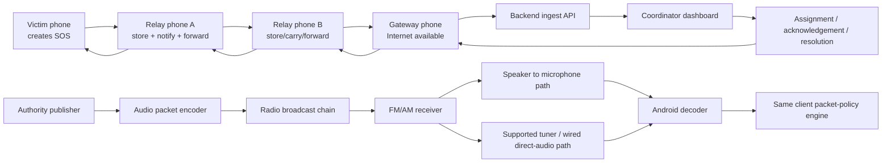

# Disaster SOS Mesh

## Final Comprehensive Product Requirements, Architecture, Packet Protocol, Build, QA, and Demonstration Blueprint

**Document status:** Canonical approved SIH product and engineering blueprint, revised after stakeholder clarification
**Target:** Smart India Hackathon prototype, with an explicit path toward field validation
**Primary client:** Android
**Application stack:** React Native with Expo tooling; Expo development/native Android build for real Bluetooth and audio integrations
**Core constraint:** Mobile phones only for Tier 1; the primary disaster area has no cellular tower, no Wi-Fi dependency, and no internet requirement
**Tier 1 transport:** Android Bluetooth phone-to-phone mesh; BLE preferred, modular Bluetooth fallback only if required by the selected device matrix
**Official Tier 2 modem:** ggwave
**Official Tier 2 demo:** Prepared radio-program audio, demonstrated through both microphone and direct-audio decoding paths
**Region scope:** One predownloaded city/region for the hackathon
**Date:** 22 August 2026

---

## 0. Final confirmed decisions and supersession rules

This revision resolves the comments in the earlier draft. These decisions are binding. If any older paragraph conflicts with this section, this section and the three files in `docs/agent-reference` take precedence.

1. **The tower is down.** The core product is designed for phones that have no usable mobile network, Wi-Fi, or internet. Internet is an opportunistic extension, never a prerequisite.
2. **Tier 1 is Bluetooth only.** Phones discover, store, carry, and relay packets over Android Bluetooth. BLE is preferred; the implementation remains modular enough to use another Android Bluetooth mode on the controlled device set if BLE cannot deliver the demonstration. ggwave is never a Tier 1 fallback.
3. **Every participating phone can become a node.** A phone may create, receive, store, display, carry, relay, or—if it later proves usable internet—act as a temporary gateway.
4. **Four directions are part of the architecture:** mesh-to-mesh, mesh-to-internet when a real gateway appears, internet-to-mesh through that gateway, and Tier 2 radio-to-phone with optional radio-to-mesh bridging.
5. **Tier 2 is one-way ggwave authority data.** It carries compact alerts, resource/map deltas, cached-content references, and check-in requests through prepared radio-program audio. Responses return through Tier 1 or a later gateway.
6. **There is no local ggwave phone-to-phone path.** Microphones/speakers are not an emergency fallback for Tier 1.
7. **The Android app uses React Native and Expo tooling.** Stock Expo Go may support UI and simulation work, but the real Bluetooth/audio build must be an Expo development/native build containing the required Android APIs.
8. **The map is predownloaded for one city/region.** Hospitals, shelters, food/water points, safe zones, help centres, roads, guides, languages, and forms exist locally before the outage. Compact Tier 1, gateway, and Tier 2 packets update the same map projection.
9. **The map shows operational people and topology carefully.** SOS owners, responders, and shareable peer observations may appear with timestamp, accuracy, and freshness. The topology view shows observed recent relationships, not an omniscient real-time global mesh.
10. **All packet families are included:** SOS, update/cancel, responder lifecycle, acknowledgements, shelters, hospitals, food/water, safe zones, hazards, route blockages, official alerts, check-ins, resource requests, and bounded files/images.
11. **Citizens do not publish authoritative infrastructure.** General Public users primarily create SOS, updates/cancellations, check-in responses, and enabled help/resource requests. Optional citizen hazard reports are clearly community-reported and lower authority. Responders/authority roles publish operational records under the prototype role policy.
12. **Severity is not authority.** A citizen Level 3 SOS is urgent but is not automatically official or verified.
13. **Packet size is a first-class budget.** Known objects use compact numeric IDs; updates send only changed fields; duplicates are suppressed; ggwave payloads are kept especially small; files/images are requested, fragmented, bounded, and always lower priority than emergencies.
14. **The prototype does not claim production cryptographic verification.** It uses strict parsing, checksums/digests, ggwave error correction, repetition, expiry, hop limits, deduplication, and demo-provisioned roles. Authority/responder labels describe the controlled workflow, not mathematical proof of identity.
15. **Local rescue is a complete success condition.** A nearby responder can accept, travel, arrive, and resolve an SOS through the local mesh even if no internet gateway ever appears.
16. **Gateway truth is explicit.** A phone becomes a gateway only after a live probe. It uploads queued packets and downloads acknowledgements, assignments, alerts, and regional changes, then broadcasts eligible packets back into the mesh.
17. **Authority and broadcaster use web dashboards.** The authority/coordinator manages incidents, responders, resources, alerts, and campaign approval. The broadcaster manages approved campaign inventory, audio preview, decode-before-broadcast testing, schedule/export, and logs.
18. **Received network packets are not manually accepted or rejected by ordinary users.** The client automatically validates, stores, displays, relays, and applies them according to policy. Users may acknowledge alerts, answer check-ins, accept responder assignments, or act on information.

### Required truth language

- “Copied to a nearby phone” means link-level custody only.
- “Seen by responder” requires a responder action.
- “Uploaded” requires a proven gateway and completed upload.
- “Accepted by coordination centre” requires a returned backend acknowledgement.
- “En route” does not mean arrived.
- “Arrived” does not necessarily mean resolved.
- A peer or responder marker is never called live without a recent timestamp.
- A demo authority/responder label is never called cryptographically verified.

---

## 1. Executive definition

Disaster SOS Mesh is an Android emergency communication system that continues to provide useful communication when mobile data, Wi-Fi, and conventional telecom infrastructure are unavailable or unreliable.

It combines two complementary networks:

1. **Tier 1 — bidirectional, local-to-extended BLE relay network.** A phone creates an SOS or another useful packet. Nearby participating phones automatically receive, validate, store, prioritize, and relay it. The packet continues through device-to-device hops until it reaches an internet-connected gateway, expires, is resolved, or is deliberately discarded under a defined policy. Every eligible relay can also create local value by showing nearby SOS reports, shelters, medical help, safe zones, hazards, and other location-relevant information.
2. **Tier 2 — long-range, one-way authority broadcast.** An authority encodes multiple small digital packets into audio that is carried inside an AM/FM radio program. A phone decodes the audio either through its microphone listening to a nearby radio speaker or through a supported direct audio/tuner path. Tier 2 distributes official alerts and data to many people but does not provide an uplink from citizens to the broadcaster.

The system is not merely a Bluetooth chat application. It is a **delay-tolerant, priority-aware disaster packet network** in which each participating phone can act as:

- an emergency beacon;
- an automatic store-and-forward relay;
- a temporary internet gateway;
- a local information terminal;
- a responder tool;
- and, for Tier 2, an emergency broadcast decoder.

The mobile product has two primary operating modes: **General Public** and **Responder**. Responders receive prioritized SOS information, accept or decline assignments, publish en-route/arrived/resolved states, and can provide permitted operational resource or hazard updates. Authority, coordinator, and radio broadcaster work occurs through the online web dashboard.


### Product promise

> When infrastructure fails, the system remains useful through local Bluetooth relay and store-carry-forward, can extend outward through any later proven internet gateway, and can receive long-range compact authority information through Tier 2 radio audio.


### Approved hackathon decisions

The following decisions are committed for the SIH build and are no longer alternatives:

- ggwave is the official Tier 2 data-over-sound modem.
- Tier 2 sends multiple unified packets in a prioritized, repeating audio carousel.
- The team will create its own radio-program demonstration audio containing speech/program material and ggwave-encoded packet segments.
- The prepared audio represents the broadcaster/program-chain output for the hackathon; integration with a licensed live station is post-hackathon deployment work.
- Both Tier 2 receiver paths will be shown: acoustic speaker-to-phone-microphone decoding and direct PCM/audio-input decoding.
- The direct-audio demonstration validates a clean receiver-audio-to-decoder path. It does not claim that every Android phone exposes an internal FM tuner to third-party applications.
- The Tier 2 hackathon payload scope is compact structured messages, campaign manifests, cached-object references, and small map/resource changes. It can update help centres, hospitals, shelters, hazards, routes, and check-in prompts using compact IDs and geospatial/audience policy. Large files and maps are not transmitted over ggwave.

### India-specific problem fit

India already has a large government-to-citizen warning system. NDMA's CAP-based SACHET platform is operational across all 36 States and Union Territories, and an April 2026 Government of India release reported more than 134 billion geo-targeted SMS alerts in more than 19 Indian languages. India launched its indigenous nationwide Cell Broadcast System in May 2026, integrated with SACHET for rapid geo-targeted public warnings.

Those systems are important complements, not competitors. They primarily distribute authority warnings through telecom infrastructure. Disaster SOS Mesh addresses the remaining off-grid and citizen-to-responder path when a participating phone cannot use the cellular network: local SOS creation, peer relay, store-carry-forward, eventual gateway upload, and local responder receipt. Tier 2 adds a separately demonstrated radio-audio downlink for conditions in which an ordinary radio receiver remains available.

The CDRI/DoT telecom-resilience study mapped approximately 0.77 million Indian telecom towers and documented multi-hazard exposure. The pitch must describe that number accurately as towers mapped/assessed, not claim that every one of those towers simultaneously fails or is equally exposed.


Recommended SIH positioning:

> SACHET and Cell Broadcast provide large-scale official alerts while telecom infrastructure is reachable. Disaster SOS Mesh complements them with an off-grid local uplink, peer-to-peer responder path, delay-tolerant gateway path, and a radio-audio proof of concept for compact authority data.

The older Team Doc v3 decision that radio receive was “future scope only” is superseded by this blueprint's approved hackathon scope. Live licensed-broadcaster integration remains future work, but the ggwave radio-program sender artifact and both receiver paths are part of the demo.

---

## 2. Product intent and non-negotiable design principles

### 2.1 Intended outcomes

The product must support two independent success conditions for a citizen-originated packet:

- **Local success:** another relevant person or responder receives and can act on the packet without internet.
- **Extended success:** a relay that later proves usable internet uploads the packet and its minimum necessary incident/profile reference to the coordination backend. The backend may return acknowledgements, assignments, alerts, and compact regional updates through that gateway and back into the mesh.

Local success is not a fallback implementation detail. It is a first-class product outcome. A disconnected village may have useful responders nearby even when no phone can reach the internet.

Users must see whether information arrived through Tier 1 Bluetooth, a gateway, or Tier 2 radio. ggwave is used for compact structured machine-readable data and cached-content references, not as a replacement for ordinary voice communication. Every transport applies bounded corruption detection; Tier 2 additionally uses the ggwave modem's error correction and scheduled repetition.

### 2.2 Automatic relay behavior

The network carries multiple typed packet families with different severity, priority, display, retention, and forwarding behavior. Every participating phone may act as a receiver, sender, and relay at different times. The topology and packet-journey views derive from observed discovery, transfer, gateway, and radio-bridge events.

After the user creates an SOS, relay phones work automatically while emergency mode is enabled. A relay phone:

1. discovers neighboring participants;
2. exchanges small inventories or packet summaries;
3. requests only missing eligible packets;
4. validates their headers and content;
5. stores accepted packets locally;
6. notifies the user when the information is locally relevant;
7. forwards eligible packets according to priority, expiry, routing value, battery, and congestion;
8. uploads packets when an internet path appears;
9. propagates acknowledgements and resolution updates back into the mesh.
10. publishes recent node, peer, packet-journey, and gateway observations to the local diagnostic/topology projection;
11. uses inventory knowledge, packet headers, priority queues, copy budgets, neighbor overlap, and gateway freshness to reduce congestion and decide what to send next.

The packet does not disappear after a single successful hop. It remains under the custody policy until one of the following terminal conditions applies:

- a backend gateway receipt is obtained and the configured post-upload replication period ends;
- an allowed prototype responder/coordinator sends a `RESPONDER_ARRIVED` or `RESOLVED` packet;
- the source explicitly cancels it;
- its time-to-live expires;
- a valid authority revocation invalidates it;
- or local safety/resource limits force eviction under the documented priority rules.

### 2.3 What “until help reaches the SOS person” means technically

A phone cannot infer with certainty that a responder physically reached the victim. The network needs an explicit proof or acknowledgement:

- responder presses **Arrived** and creates a role-labeled status update;
- victim confirms **Help reached me**;
- responder and victim complete a short-range BLE proximity handshake;
- coordinator marks the case resolved, producing a terminal resolution packet;
- or, for the prototype, a demonstrable combination of responder acknowledgement plus close BLE proximity is used.

Until such an event occurs, `RESPONDER_EN_ROUTE` means assistance is planned, not that the emergency is resolved.

### 2.4 Client-side intelligence

Header and policy processing occurs on each phone. The phone independently decides whether to:

- **store** the packet;
- **display or notify** the local user;
- **relay** the packet onward;
- **upload** it if internet is available;
- **act on it**, such as placing a shelter on the offline map.

These are separate decisions. For example, a shelter packet outside the current user's chosen radius may not be displayed, but the phone may still relay it toward people in that region.

### 2.5 Binary transport does not imply unlimited capacity

All digital information is ultimately binary, so the protocol can represent text, structured records, images, maps, documents, and other files. However, BLE mesh and audio broadcast bandwidth remain finite. The protocol therefore supports files through manifests, chunks, prioritization, compression, and strict size limits. Text and structured emergency information always take precedence over large files.

---

## 3. Users and operating roles

| Role | Primary capabilities |
|---|---|
| Affected citizen | Create SOS; receive local alerts; view nearby help; confirm safety or resolution |
| Ordinary relay participant | Automatically store and relay eligible packets; optionally view relevant local information |
| Volunteer/community responder | Receive prioritized SOS reports; declare en route/arrived; add local resources and hazards |
| Official field responder | All responder capabilities plus provisioned prototype status, operational updates, and case assignment |
| Internet gateway phone | After a live connectivity probe, upload queued packets and download acknowledgements/official data |
| Coordinator | Deduplicate, validate, prioritize, assign, monitor, acknowledge, and resolve incidents |
| Authority publisher | Create provisioned Tier 2 campaigns and official prototype Tier 1 packets |
| Radio broadcaster | Insert encoded audio into an approved broadcast chain |

Roles affect display and source labeling, but ordinary phones must not be prevented from relaying public emergency packets simply because their owners are not responders.

Authority Publisher, Coordinator, and Radio Broadcaster use an online web dashboard rather than the mobile app. The authority/coordinator manages incidents, assignments, regional data, alerts, campaign creation, and approval. The broadcaster manages only approved campaign inventory, audio preview, decode-before-broadcast testing, scheduling/export, and broadcast logs.
---

## 4. System architecture



### 4.1 Main components

#### Android application

- emergency user interface;
- packet builder and binary codec;
- validation and trust engine;
- durable local packet store with platform-appropriate protection where available;
- BLE discovery, advertising, and GATT transfer engine;
- routing and congestion controller;
- internet gateway uploader/downloader;
- offline map and local-help view;
- audio capture and Tier 2 decoder;
- battery and storage policy manager;
- audit/event log suitable for testing.

#### BLE neighbor-discovery plane

- broadcasts a small service identifier and changing node token;
- announces capability and queue summaries, not full SOS content;
- discovers peers without exposing victims' exact locations in advertisements;
- initiates a data connection only when useful work exists.

#### BLE data plane

- uses a short-lived GATT connection for inventory comparison and packet/chunk transfer;
- negotiates MTU and PHY where supported;
- falls back to mandatory LE 1M when Coded PHY is unavailable;
- closes idle connections to conserve energy and device slots.

#### Local packet database

- stores packet envelope, payload, trust state, custody state, routing history, and expiry;
- supports deduplication by packet ID and payload hash;
- keeps a compact seen-packet cache after payload deletion to suppress loops;
- encrypts sensitive data at rest.

#### Gateway service

- observes validated internet availability rather than assuming a connected icon means usable internet;
- batches uploads to reduce cellular radio wakeups;
- downloads gateway receipts, assignments, authority packets, and revocations;
- injects those packets back into the local mesh when permitted.

#### Backend

- authenticated packet-ingestion API;
- deduplication and conflict resolution;
- incident aggregation;
- prototype role/source registry and future production-security boundary;
- geospatial database;
- responder assignment and status workflow;
- outbound packet generation;
- metrics, audit logs, and abuse controls.

#### Coordinator dashboard

- incident map and list;
- severity, age, confidence, and type filters;
- duplicate/corroboration grouping;
- assignment and response status;
- packet/gateway provenance;
- last-known victim location with accuracy and age;
- acknowledgement and resolution controls.

#### Tier 2 publisher

- provisioned authority message composer;
- packetizer and scheduler;
- audio modem encoder;
- forward error correction, interleaving, and repetition;
- audio preview and automated decode-before-broadcast test;
- versioned broadcast campaign manifest with integrity values.

### 4.2 Unified transport boundary without a local acoustic fallback

Tier 1 and Tier 2 use distinct transport adapters that feed the same validator, durable store, policy engine, and map/incident projection.

- **Tier 1 primary:** Android BLE discovery and bidirectional sessions between participating phones.
- **Tier 1 contingency:** another Android Bluetooth mode may replace BLE on the selected device matrix if necessary. It must preserve the same packet/session contract.
- **Tier 2 only:** prepared radio-program audio decoded with ggwave. It is authority-to-phone and one way.
- **Explicit exclusion:** no phone-to-phone ggwave fallback, no automatic speaker transmission, and no Tier 1 microphone listening.

The React Native application remains transport-independent. Native Android adapters publish normalized capability, peer, session, byte, and error events. The real integrated build uses an Expo development/native build because the standard Expo Go native runtime does not contain arbitrary Bluetooth/GATT server modules.

---
## 5. Tier 1 end-to-end network flow

### 5.1 SOS creation

1. User presses the large SOS control.
2. The app captures the last known location immediately.
3. It requests a fresh location for a short, bounded period when possible.
4. User selects emergency type, severity, people count, mobility, and an optional short note.
5. The app creates a canonical binary payload.
6. It assigns an unpredictable 128-bit packet ID.
7. It adds creation time, expiry, geographic scope, routing limits, and integrity metadata.
8. It writes the packet durably to local storage before showing “SOS created.”
9. It enters active emergency relay mode and advertises packet availability.

If GPS is unavailable, the packet still exists. Location can be marked unknown, stale, network-derived, user-selected on an offline map, or updated later with an `SOS_UPDATE` packet.

### 5.2 Discovery

Phones alternate between advertising and scanning. An advertisement should contain only:

- protocol service UUID;
- rotating node token;
- protocol version range;
- capability bitset;
- highest queued priority;
- short queue digest or epoch;
- gateway-availability bit;
- optional coarse region code;
- connection invitation flag.

Exact victim coordinates and SOS text must not appear in public BLE advertisements.

### 5.3 Session and inventory exchange

When two nodes determine that a session may be useful:

1. they establish a GATT connection;
2. exchange `HELLO/CAPABILITY` records;
3. negotiate application protocol version, MTU, supported PHY, compression, maximum chunk size, and current resource state;
4. exchange compact packet inventories using recent packet IDs, ranges, or a Bloom-filter-like summary;
5. request missing packets in priority order;
6. transfer packets or fragments;
7. acknowledge structurally valid durable receipt at the link/application layer;
8. exchange any pending receipts or resolution tombstones;
9. close the connection when useful work ends.

The inventory summary can produce false positives if a Bloom filter is used, so critical packets should also have periodic explicit ID reconciliation.

### 5.4 Automatic hop and custody

Receiving a link acknowledgement means only that the next phone received and validated the packet. It does not mean an authority or responder has seen it.

Recommended custody states are:

```text
CREATED_LOCAL
  -> STORED_LOCAL
  -> SEEN_BY_PEER
  -> CUSTODY_COPIED
  -> UPLOADED_TO_GATEWAY
  -> BACKEND_ACKNOWLEDGED
  -> RESPONDER_ASSIGNED
  -> RESPONDER_EN_ROUTE
  -> RESPONDER_ARRIVED
  -> RESOLVED

Alternative terminal states:
  EXPIRED | CANCELLED | REVOKED | EVICTED
```

The default uses **replicated custody**, not destructive handoff: the sender retains its SOS after another node receives it. Low-priority bulk data may use single-custodian transfer when storage is constrained, but SOS packets should keep controlled redundancy.

### 5.5 Gateway upload

When a relay gains usable internet:

1. it groups queued packets into a bounded batch;
2. uploads originals plus necessary provenance metadata;
3. backend validates, deduplicates, stores, and returns integrity-checked gateway acknowledgement packets;
4. gateway stores receipts and later relays them over BLE;
5. other nodes reduce unnecessary replication after receiving a valid receipt but retain high-priority packets for a configurable safety period;
6. the victim sees “received by coordination centre” only after the backend receipt reaches their phone.

### 5.6 Responder completion

The responder workflow is:

1. `RESPONDER_ASSIGNED` — coordinator assigns a case.
2. `RESPONDER_EN_ROUTE` — responder accepts and begins travel.
3. `RESPONDER_ARRIVED` — responder declares arrival, ideally accompanied by proximity evidence.
4. `RESOLVED` — victim, trusted responder, or coordinator closes the incident.
5. A resolution tombstone propagates to stop further SOS forwarding while preserving a minimal audit record.

---

## 6. Routing and forwarding design

Routing is deterministic, priority-aware, congestion-bounded, and explainable in diagnostics. The hackathon routing path requires structural/integrity validation but does not depend on production cryptographic verification.
### 6.1 Why “farthest hop” alone is insufficient

Choosing the geographically farthest neighbor is useful only relative to a destination. The network needs a target such as:

- a known relief centre;
- a recent internet gateway location;
- the boundary of an outage zone;
- a command centre;
- or a responder route.

GPS distance also does not reveal rubble, walls, radio interference, or whether a neighbor will continue moving in a useful direction. Therefore farthest-progress is one factor in a routing score, not the entire routing algorithm.

### 6.2 Recommended hybrid routing policy

For each neighbor `n` and packet `p`, calculate a bounded forwarding utility:

```text
score(n,p) =
    Wg * verifiedInternet(n)
  + Wd * destinationProgress(n,p)
  + Wv * expectedNovelReach(n)
  + Wm * usefulMobility(n,p)
  + Wr * linkReliability(n)
  + Ws * sourceRoleUtility(n,p)
  + Wb * batterySuitability(n)
  - Wq * queueCongestion(n)
  - Wc * recentCopyOverlap(n,p)
```

SOS priority can override battery and congestion thresholds, but it must not override structural, integrity, length, expiry, or duplicate validation.

### 6.3 Forwarding modes

| Mode | Use |
|---|---|
| Direct gateway | Neighbor has verified internet; highest preferred outcome |
| Directed greedy | Known destination/relief point; forward to nodes making geographic progress |
| Controlled epidemic | Unknown destination; copy to a limited number of novel, useful peers |
| Store-carry-forward | No useful neighbor; retain until the phone moves or a new peer appears |
| Local broadcast | Notify eligible nearby users even without onward progress |
| Perimeter/fallback | Greedy routing is stuck at a local maximum; use alternate neighbors or limited flooding |

### 6.4 Copy budgets

Each packet class has a replication budget rather than unlimited flooding:

- Critical SOS: high copy budget, short retry intervals, wide local display scope.
- Medical/hazard alerts: medium-high budget.
- Shelter/resource records: medium budget and longer expiry.
- General bulletin: medium or low budget.
- File chunks: low budget, receiver-requested only.

A copy budget can be represented as a logical token count that is split across relays, or as a per-node rule such as “forward to at most three novel peers per epoch.” The hackathon implementation can use the simpler per-node rule.

### 6.5 Loop prevention and deduplication

- packet ID is immutable across hops;
- hop count increments at each application-level relay;
- hop limit prevents indefinite travel;
- expiry is evaluated using a tolerant clock policy;
- recent-sender history prevents immediate bounce-back;
- seen-ID cache suppresses duplicate payload processing;
- payload hash detects corruption and conflicting reuse of an ID;
- backend groups multiple uploads of the same packet;
- resolution tombstones terminate stale replicas.

### 6.6 Priority scheduler

Use weighted queues with starvation protection:

1. life-critical SOS and resolution/acknowledgement control packets;
2. medical, evacuation, fire, flood, and hazard alerts;
3. responder assignment and local-help records;
4. short official bulletins;
5. file manifests;
6. requested file chunks;
7. nonessential bulk data.

Control traffic must have reserved capacity so large transfers cannot block SOS delivery.

---

## 7. Unified packet protocol

### 7.1 Encoding choice

Recommended encoding:

- fixed binary transport header for fast rejection and routing;
- deterministic CBOR or a similarly compact canonical binary format for typed payloads;
- big-endian network byte order for fixed fields;
- BLAKE3/SHA-256-derived payload digest;
- header/frame CRC or equivalent corruption detection;
- compact source-role and campaign labels provisioned for the controlled prototype.

JSON may be used for debugging and the backend API but should not be the over-the-air canonical representation.

The 64-byte envelope below is the full Tier 1 design target. Tier 2 may use a more compact bounded frame/operation representation that maps deterministically into the same logical packet model; wasting a full 64-byte header on every ggwave operation is not required.

### 7.2 Fixed transport header: 64 bytes

| Offset | Size | Field | Purpose |
|---:|---:|---|---|
| 0 | 2 | Magic | Quickly rejects unrelated/corrupt traffic |
| 2 | 1 | Protocol version | Version negotiation and compatibility |
| 3 | 1 | Message type | SOS, shelter, alert, file chunk, receipt, etc. |
| 4 | 2 | Flags | Fragmented, prototype-authority, receipt requested, location present, map delta, terminal |
| 6 | 1 | Priority | 0–7 scheduling priority |
| 7 | 1 | Header length | Allows optional extensions |
| 8 | 16 | Packet ID | Globally unpredictable deduplication key |
| 24 | 8 | Ephemeral source ID | Rotating pseudonymous source identifier |
| 32 | 4 | Created time | Unix time or disaster-epoch time |
| 36 | 4 | Expiry time | Absolute expiry; paired with hop limit |
| 40 | 1 | Hop limit | Maximum permitted relays |
| 41 | 1 | Hop count | Relays already completed |
| 42 | 4 | Total payload length | Reassembly and safety limit |
| 46 | 2 | Fragment index | Zero-based fragment number |
| 48 | 2 | Fragment count | Total number of fragments |
| 50 | 8 | Payload digest prefix | Fast corruption/conflict check |
| 58 | 2 | Source/campaign class | Selects prototype role/campaign policy |
| 60 | 4 | Header CRC | Detects accidental header corruption before expensive processing |

Payload integrity and any future production-security material are kept outside mutable hop observations so relays do not rewrite source meaning.

### 7.3 Optional header extensions

| Extension | Suggested fields |
|---|---|
| GEO | Latitude E7, longitude E7, accuracy metres, scope radius |
| DESTINATION | Destination type, destination coordinates/region, destination ID |
| ROUTING | Copy budget, previous-hop token, route class |
| SOURCE_POLICY | Prototype role, audience class, disclosure group, future-security version |
| FILE | File ID, chunk size, content type, compression, erasure-code profile |
| BROADCAST | Campaign ID, cycle number, authority channel, repetition policy |
| PROVENANCE | Observation type, gateway token, corroboration relation |
| SOURCE_STATE | Per-source sequence number, source role, battery band, movement state |
| AUDIENCE | Intended roles, language set, opted-in family/group code |
| CONTENT_REF | Bundle ID, bundle version, object ID, action opcode, expected content hash |

Extensions are included only when needed.

### 7.4 Immutable packet meaning and mutable relay observations

The hackathon prototype separates source-created meaning from relay observations even though it does not implement production cryptographic verification:

- **immutable logical packet:** source class, packet ID, type, creation/expiry, original location, payload digest, source sequence, and payload;
- **mutable relay observation:** hop count, previous-hop token, received time, link observations, and local custody state.

Relays must not rewrite incident meaning, identity, severity, or payload. They may add bounded observations and increment hop state. A future production security layer can protect the immutable region without changing routing or product semantics.

### 7.5 Core message types

| Code family | Message | Function |
|---|---|---|
| Emergency | `SOS_CREATE` | Original request for assistance |
| Emergency | `SOS_UPDATE` | New location, condition, people count, or note |
| Emergency | `SOS_CANCEL` | Source cancels accidental/no-longer-needed SOS |
| Response | `BACKEND_RECEIPT` | Coordination backend has accepted the packet |
| Response | `RESPONDER_ASSIGNED` | A responder has been assigned |
| Response | `RESPONDER_EN_ROUTE` | Responder is traveling |
| Response | `RESPONDER_ARRIVED` | Responder reports physical arrival |
| Response | `RESOLVED` | Incident is closed and replicas may stop |
| Help | `SHELTER` | Shelter location, capacity, opening hours, verification time |
| Help | `MEDICAL_POST` | Medical help location and capabilities |
| Help | `FOOD_WATER` | Resource distribution point |
| Help | `SAFE_ZONE` | Authority/responder-designated safe area in the prototype workflow |
| Hazard | `HAZARD` | Fire, flood, road blockage, collapse, contamination |
| Navigation | `ROUTE_SEGMENT` | Small route/path instruction or blocked-road update |
| Authority | `OFFICIAL_ALERT` | Provisioned authority warning or evacuation instruction |
| Authority | `WEATHER_BULLETIN` | Compact forecast or hazard data |
| Data | `FILE_MANIFEST` | Metadata and hashes for a file |
| Data | `FILE_CHUNK` | Requested fragment of a file |
| Cached content | `CACHE_CATALOG` | Declares authority content bundles and their versions |
| Cached content | `CONTENT_ACTIVATE` | Opens or applies an already-cached map, guide, form, prompt, or record |
| Cached content | `RECORD_UPSERT` | Adds or replaces a small structured record in a cached bundle |
| Cached content | `RECORD_TOMBSTONE` | Removes or invalidates a cached record |
| Cached content | `CACHE_INVALIDATE` | Marks a bundle/version unsafe or obsolete |
| Campaign | `CHECKIN_CAMPAIGN` | Activates a cached response form that creates Tier 1 packets |
| Communication | `MESH_CHAT` | Bounded plaintext addressed chat carried and persisted by Tier 1 |
| Network | `HELLO_CAPABILITY` | Protocol, PHY, storage, battery, role, and gateway capability |
| Network | `INVENTORY` | Compact list/digest of available packets |
| Network | `PACKET_REQUEST` | Requests missing packet IDs/fragments |
| Network | `LINK_RECEIPT` | Confirms neighbor receipt, not end-to-end delivery |
| Network | `CONTENT_WITHDRAWAL` | Invalidates bad, obsolete, or withdrawn prototype content |

### 7.6 Example SOS payload

```text
emergency_type: MEDICAL | TRAPPED | FIRE | FLOOD | VIOLENCE | OTHER
severity: 0..3
people_total: unsigned integer
children: optional unsigned integer
injured: optional unsigned integer
mobility: MOBILE | LIMITED | IMMOBILE | UNKNOWN
source_sequence: monotonically increasing per incident/source stream
battery_band: HIGH | MEDIUM | LOW | CRITICAL
location_source: FRESH_GNSS | CACHED | NETWORK | USER_PIN | UNKNOWN
location_age_seconds: unsigned integer
short_note: UTF-8, strict byte limit
language_code: compact language tag
reply_capabilities: BLE | INTERNET | SMS | VOICE
language_preferences: compact ordered language codes
group_code_hash: optional opted-in family/group rendezvous identifier
```

Personally identifying information should be optional and minimized. A nearby responder usually needs location, emergency type, severity, and people count more than the victim's full identity. Production encryption is future hardening, so synthetic identities must be used in the hackathon.

### 7.7 Typical packet sizes

| Packet | Approximate encoded size |
|---|---:|
| Capability/inventory control | 40–200 B |
| Compact SOS without note | 110–160 B |
| SOS with short note and extended metadata | 160–300 B |
| Shelter or hazard record | 140–400 B |
| Official short alert | 150–500 B |
| File manifest | 200–1,000 B |
| File chunk | 512–4,096 B, negotiated |

These are engineering targets, not guaranteed final sizes. Automated tests must enforce maximum decoded lengths before allocation.

---

## 8. Client-side packet acceptance and GPS-aware services

### 8.1 Validation pipeline

Every received packet passes through the following ordered gates:

1. minimum length and magic;
2. supported protocol version;
3. declared lengths within hard limits;
4. header CRC;
5. packet ID and duplicate lookup;
6. message type recognized or safely ignorable;
7. creation/expiry sanity with clock-skew tolerance;
8. hop count below hop limit;
9. fragment limits and reassembly budget;
10. payload digest;
11. source-role/campaign policy and type/role legality;
12. withdrawal, rate, and abuse rules;
13. geographic scope;
14. role, language, user preference, storage, battery, and congestion policy.

No untrusted length or fragment count may be used to allocate unlimited memory.

### 8.2 Independent policy outputs

```text
decision(packet) -> {
  accept_for_storage: yes/no,
  show_to_user: yes/no,
  alert_user: none/silent/normal/critical,
  relay_class: never/opportunistic/normal/urgent,
  upload_when_online: yes/no,
  retention_seconds: value,
  reason_codes: [...]
}
```

### 8.3 Geographic relevance

The client can use current or last-known GPS and the packet's geographic extension to provide:

- nearest shelters;
- nearest medical posts;
- food and water points;
- safe zones;
- hazards near the citizen;
- evacuation routes and blocked roads;
- SOS reports within a responder's chosen radius;
- direction and distance to help using offline coordinates.

Distance should be calculated locally. The UI must show location age and accuracy. “300 m away” must not imply exactness when the source location is old or has ±200 m accuracy.

### 8.4 Geographic acceptance rules

- Critical official national/regional alert: store and display if the device is within scope; relay according to policy even if current location is unknown.
- SOS: nearby responders display it; other nodes may relay without displaying it.
- Shelter/resource: display inside user-selected radius; relay toward its target region or when copy budget permits.
- Hazard: display more aggressively when the user's route or current region intersects it.
- Unknown location: do not discard critical packets solely because GPS is unavailable.
- Stale location: widen uncertainty boundary instead of making a binary precise-distance decision.

### 8.5 Source-aware presentation

Display badges such as:

- Authority-dashboard issued (prototype);
- Provisioned responder (prototype);
- Community reported;
- Corroborated by multiple independent devices;
- Unknown source;
- Expired or superseded.

Source category and corroboration affect presentation and prioritization, but the UI must not imply cryptographic verification.

### 8.6 Additional client-side rules adopted from Team Doc v3

| Client feature | Required behavior |
|---|---|
| Role-based channels | Civilian, medical, fire, volunteer, and coordinator roles receive different presentation and action controls without changing the underlying packet transport |
| Latest-wins state | For update streams, compare `source_id + incident_id + source_sequence`; retain history for audit but make the newest valid sequence the active state |
| Battery-aware relay | Below configured battery bands, stop bulk/file traffic first, then low-priority traffic; always preserve the phone owner's active SOS and critical control packets |
| Hazard overlay | Render validated `HAZARD` and `ROUTE_SEGMENT` records over the precached offline map |
| Family/group check-in | An opted-in hashed group code lets family/team members share last-known status without publishing a human-readable family identifier in advertisements |
| Language filtering | Select a matching cached translation when possible; otherwise show the compact fallback text and mark that the preferred language was unavailable |
| Transport transparency | Apply the same validation and policy regardless of Tier 1 Bluetooth, Tier 2 radio audio, or internet gateway, while retaining transport provenance for diagnostics |

Geofencing should generally control display and forwarding preference rather than blindly discard every out-of-radius packet. A phone outside the display radius may still be a useful carrier toward the target region.

### 8.7 Rescuer final-approach assistance

GPS may be stale or inaccurate indoors, under rubble, or in narrow valleys. Once a responder is physically close and the victim phone is still advertising, the responder UI may show a smoothed BLE RSSI/proximity trend:

- “signal becoming stronger/weaker,” not an exact metre estimate;
- last confirmed GPS location, age, and accuracy;
- last movement/status update;
- last direct BLE contact time;
- optional proximity-handshake control for `RESPONDER_ARRIVED`.

RSSI fluctuates with orientation, bodies, walls, and multipath. It must be presented as a directional search aid, never as a precise distance or burial-depth measurement.

### 8.8 Explainable triage assistance

The Team Doc proposes an ML triage workstream based on battery, stillness, and time since update. For the hackathon, implement this first as an explainable deterministic score so judges and responders can inspect every reason:

```text
triage_score =
    emergency_severity_weight
  + trapped_or_immobile_weight
  + injured_people_weight
  + stale_contact_weight
  + low_battery_contact_risk
  + corroboration_weight
  - resolved_or_responder_arrived_weight
```

The score ranks the coordinator queue; it never decides that a person should be denied help. “Still” and “low battery” are weak signals and must be labeled as such. A later ML model is acceptable only after a useful labeled dataset and fairness/error evaluation exist.

---

## 9. File and structured-data transfer

### 9.1 Supported data categories

- compact text instructions;
- structured shelter/resource/hazard records;
- compressed offline map tiles or route segments;
- small images useful for identification or damage context;
- PDFs or documents only under strict size/policy limits;
- authority public keys, revocation lists, and configuration updates.

### 9.2 File protocol

1. Sender creates `FILE_MANIFEST` containing file ID, name, MIME type, total bytes, whole-file hash, chunk size, chunk count, priority, expiry, and optional thumbnail.
2. Receiver evaluates relevance, storage, battery, and network budget.
3. Receiver requests selected missing chunks.
4. Sender transfers `FILE_CHUNK` packets.
5. Each chunk is independently hashed.
6. Receiver resumes interrupted downloads using a chunk bitmap.
7. Whole-file hash is verified before the file becomes visible.

### 9.3 Safety limits

- default citizen file limit: 100–250 KB for the prototype;
- higher limits only for official or user-approved transfers;
- no automatic executable installation;
- MIME sniffing and extension mismatch detection;
- decompression ratio and output-size limits to prevent zip bombs;
- files never outrank SOS/control traffic;
- large files are pull-based, not blindly flooded;
- incomplete chunks expire and are deleted.

### 9.4 Recommended content strategy

Prefer compact structured data over screenshots or documents. A 250-byte shelter record is more searchable, filterable, translatable, and transferable than a 100-KB poster containing the same facts.

---

## 10. Tier 2: multiple packets encoded inside radio audio

### 10.1 Approved hackathon operation

For the SIH build, ggwave is the selected and required Tier 2 modem. An authority does not transmit one monolithic message. It produces a repeating carousel of small unified packets:

```text
Campaign manifest
Critical alert A
Critical alert A repeat
Shelter batch 1
Hazard batch 1
Critical alert A repeat
Shelter batch 2
Key/revocation update
Campaign manifest repeat
...
```

Packets are converted to audio waveforms by an audio modem. That waveform is mixed or scheduled inside radio program audio. The analog broadcast carries the audio to receivers. The Android decoder reconstructs frames, validates them, and passes recovered packets to the same client policy engine used by Tier 1.

For the hackathon demonstration, the team will generate this broadcaster-side output in advance as a WAV file. The file will sound and behave like a short emergency radio program: it may include a spoken station introduction and human-audible instructions, followed by or interleaved with clearly scheduled ggwave packet bursts. Playing this file through a speaker represents the radio receiver's audible output. Feeding the same decoded PCM/audio stream directly into the app represents the clean receiver-audio path.

### 10.2 Physical reception paths

#### Path A — microphone listening to a radio speaker

```text
Radio station -> FM/AM signal -> ordinary radio receiver -> speaker
-> phone microphone -> PCM audio -> decoder -> packet engine
```

Advantages:

- works with almost any Android phone with a microphone;
- does not require a phone-integrated FM tuner;
- easiest hackathon demonstration.

Limitations:

- background noise, echo, speaker quality, distance, and alignment increase loss;
- continuous microphone use requires explicit permission, a visible active mode, and meaningful battery use;
- the radio must be audible near the phone.

**SIH demonstration:** play the prepared radio-program WAV through a laptop, phone, or speaker. The Android app records the sound through its microphone, detects ggwave markers, decodes the embedded packets, verifies them, deduplicates repetitions, and renders the applicable alert/help records.

#### Path B — direct audio from a receiver

```text
Radio station -> FM/AM signal -> supported receiver/tuner
-> direct PCM/audio path -> decoder -> packet engine
```

Possible implementations:

- phone with an enabled internal FM tuner and an accessible OEM integration;
- audio cable from an external radio into a supported input/interface;
- USB audio/FM receiver exposed as an Android audio source;
- approved vendor or system application integration.

This path avoids room acoustics and should be more reliable.

**SIH demonstration:** feed the prepared WAV/PCM data directly into the same decoder through a controlled app test-input, audio file, or available cable/USB input. The UI and logs must identify this as `DIRECT_AUDIO_DEMO`, not as a universally supported live internal-FM tuner. Both demo paths must produce the same canonical packet bytes and policy decisions.

#### Important Android qualification

Android exposes broadcast-radio hardware abstractions in some system and automotive implementations, but ordinary third-party Android apps do **not** have a universal public FM-tuner API that works across consumer phones. A chipset may physically include an FM receiver while the manufacturer disables it or exposes it only to a privileged/OEM app. The build must detect capabilities at runtime and must not promise generic “system-call access” to the FM signal.

Capturing audio from another radio app is also not universally available. Android playback capture depends on platform rules, user consent, and whether the source app permits capture. It is not a dependable disaster architecture.

### 10.3 Audio frame format

Each audio frame should contain:

| Field | Function |
|---|---|
| Wake/preamble tones | Allows receiver synchronization |
| Sync word | Distinguishes protocol frames from ordinary audio |
| Protocol version | Decoder compatibility |
| Authority channel ID | Selects prototype campaign/source policy |
| Campaign ID | Groups a disaster broadcast cycle |
| Packet ID prefix | Deduplication/reassembly |
| Frame sequence | Ordering and loss detection |
| Fragment index/count | Reassembles larger packets |
| Payload length | Bounded parsing |
| Encoded packet bytes | Unified packet or fragment |
| CRC | Detects frame corruption |
| Forward error correction | Recovers limited symbol errors |
| End marker/guard interval | Decoder reset and separation |

### 10.4 Repetition, interleaving, and priority

Tier 2 has no per-receiver acknowledgement. Reliability comes from:

- repeating critical messages frequently;
- interleaving fragments so a short noise burst does not destroy adjacent parts of one message;
- forward error correction;
- including a campaign inventory so receivers know what they missed;
- cycling long-lived information;
- using smaller packets and independent validation;
- transmitting updates as new versions rather than modifying old frames.

Suggested repetition:

- life-critical alert: every 15–30 seconds;
- evacuation update: every 30–60 seconds;
- shelter/resource records: every 2–5 minutes;
- file or map chunks: remaining capacity only.

### 10.5 Official audio modem: ggwave

ggwave is officially selected for the SIH Tier 2 build. Its official project documentation states approximately **8–16 bytes per second**, uses multi-frequency FSK, and adds Reed–Solomon error correction. It is appropriate for compact alerts and records but is not suitable for fast general file delivery.

The packet framing, validation, integrity, and client policy layers remain independent from ggwave so that a different modem can be evaluated after the hackathon without redesigning the product protocol. The SONIC research prototype used a different modem stack and demonstrated **10 kbps**, with proposed multi-frequency paths at 20–40 kbps. That result must not be claimed as ggwave performance. A higher-rate SONIC/Quiet-like modem is future work, not part of the required SIH demonstration.

### 10.6 Prepared radio-program demo asset

The team must generate a reproducible, uncompressed WAV master rather than relying on a live internet stream. The recommended demo program is:

1. 3–5 seconds of spoken station identification and emergency context;
2. ggwave campaign-manifest packet;
3. ggwave critical evacuation-alert packet;
4. short spoken explanation while the app processes the first packets;
5. ggwave shelter packet for Shelter A;
6. ggwave hazard packet;
7. repetition of the critical alert;
8. ggwave shelter packet for Shelter B;
9. final campaign-manifest repeat;
10. spoken end marker.

The exact duration depends on encoded packet size and the selected ggwave profile. Every payload should be kept deliberately small. The master asset must be accompanied by:

- the canonical input packet files;
- expected packet IDs and decoded JSON/debug representations;
- ggwave protocol/profile parameters;
- sample rate, bit depth, and channel count;
- expected start/end time of every encoded burst;
- SHA-256 hashes of the master WAV and canonical packets;
- a script or repeatable build task that regenerates the WAV;
- a clean master plus optional noisy test variants.

Recommended variants are clean direct PCM, speaker/microphone at normal room noise, reduced volume, added crowd noise, and compressed/transcoded audio. The clean WAV is the judged demo fallback; lossy variants are feasibility evidence rather than the primary presentation path.

### 10.7 Client-side cached-content resolution

#### Purpose

ggwave's low bitrate becomes much more useful when Tier 2 transmits **meaning and references**, not entire assets. The Android app should already contain or be provisioned with a versioned regional content pack. A tiny Tier 2 packet can then tell the phone which local object to open, what small values changed, where it applies, and how long it remains valid.

```text
Tier 2 packet: "Activate flood guide 12, version >=3,
show route B, Shelter 41 now open, valid until 18:00"

Client: verifies packet -> resolves local bundle -> applies tiny update
-> renders full map/guide in preferred language
```

The full map, guide, icons, translations, route graph, and response form never travel over ggwave during the emergency.

#### Cache layers

| Cache layer | Contents | Update method |
|---|---|---|
| App-bundled immutable core | Basic disaster instructions, icons, schemas, common translations, default response forms | Application release |
| Preparedness content packs | Regional offline maps, shelters, hospitals, relief centres, evacuation routes, language/audio packs | Internet sync before a disaster; supervised local provisioning |
| Mesh-acquired cache | Validated resources, hazards, and optional small content packs received from peers | Tier 1 BLE/file-chunk protocol |
| Incident working set | Current Tier 2 packets, overlays, tombstones, campaign state, acknowledgements | Tier 2, BLE, and gateway updates |

Every bundle needs a stable numeric/compact `bundle_id`, semantic version, source/provisioning label, region, creation/expiry, whole-bundle integrity value, and object index. Human-readable names are display metadata and should not be sent repeatedly over the audio channel.

#### Cache-addressed packet operations

| Operation | Compact Tier 2 meaning | Client action |
|---|---|---|
| `CACHE_CATALOG` | Campaign expects bundle IDs and minimum versions | Check local availability and show readiness/missing status |
| `CONTENT_ACTIVATE` | Open object X from bundle Y with action Z | Resolve locally and render map, guide, form, prompt, or checklist |
| `RECORD_UPSERT` | Small record values changed | Atomically add/replace shelter status, capacity, hazard, or route edge |
| `RECORD_TOMBSTONE` | Record is withdrawn | Hide it from active views while retaining audit metadata |
| `CACHE_INVALIDATE` | Bundle/version is unsafe or obsolete | Stop resolving it and seek a replacement over BLE/internet later |
| `CHECKIN_CAMPAIGN` | Authority requests a specific citizen response | Open cached response form and create a new Tier 1 response packet |

Suggested compact `CONTENT_ACTIVATE` fields:

```text
campaign_id
bundle_id
minimum_bundle_version
object_id
action_opcode
small_parameters
region/geofence
language_selector
valid_from / expires_at
fallback_text
source_campaign_class
```

Action opcodes may include:

- `SHOW_MAP_OBJECT`;
- `OPEN_EVACUATION_GUIDE`;
- `APPLY_ROUTE_OVERLAY`;
- `SHOW_SHELTER_LIST`;
- `PLAY_CACHED_AUDIO_PROMPT`;
- `OPEN_MEDICAL_CHECKLIST`;
- `OPEN_CHECKIN_FORM`;
- `PIN_OFFICIAL_ALERT`;
- `REMOVE_OR_SUPERSEDE_OBJECT`.

#### Resolution algorithm

1. Validate frame, unified packet integrity, provisioned campaign/source class, TTL, and geographic scope.
2. Read `bundle_id`, minimum version, object ID, action, and expected hash/version constraints.
3. Query the local content registry without opening untrusted paths supplied by the packet.
4. Confirm that the cached bundle matches the provisioned regional pack registry, is not withdrawn, is region-compatible, passes integrity checks, and is new enough.
5. Resolve the object through its indexed ID; never interpret a Tier 2 packet as an arbitrary file path, URL, SQL query, or executable command.
6. Apply small structured parameters in a bounded schema.
7. Select the user's cached language and accessibility variant.
8. Render the result and record which cached version was used.
9. Relay the original accepted logical packet through Tier 1 if cross-tier policy permits.

#### Missing, old, or corrupted cache behavior

If the required cached object is missing or fails its integrity/version check:

- display the packet's compact fallback text and coordinates;
- clearly state that enhanced offline content is unavailable;
- never silently substitute an unrelated or older unsafe route;
- queue the missing bundle/object ID for later BLE or internet retrieval;
- accept a newer valid `RECORD_UPSERT` only when its schema does not require the absent base object;
- keep the authority packet so another phone may still relay or resolve it.

This makes Tier 2 useful even when the ideal cache is not present.

#### Cross-tier bridge: receive by radio, forward by mesh

After Tier 2 decoding, a valid packet enters the same local store as every other packet. The phone may:

- display it locally;
- resolve cached content;
- advertise its packet ID over BLE;
- relay the original accepted packet to nearby phones;
- upload it as a reception observation when internet returns;
- share a missing small content object through Tier 1's manifest/chunk protocol if policy permits.

The bridge must preserve the authority workflow's original logical packet identity, version, payload digest, and meaning. The relay adds only mutable transport provenance. Packet ID, TTL, geofence, copy budget, and seen-cache rules prevent amplification loops between radio and Bluetooth.

This bridge lets one radio-listening phone carry an official alert into a building, shelter, or group of phones whose microphones were not listening. It does not create a radio uplink.

#### Client-generated response using cached forms

Tier 2 can request information without receiving it directly. For example, an authority broadcasts a provisioned `CHECKIN_CAMPAIGN` packet that activates a cached multilingual form:

```text
SAFE
NEED_MEDICAL_HELP
TRAPPED
NEED_WATER
NUMBER_OF_PEOPLE
CURRENT_LOCATION
```

The citizen's selection creates a new compact Tier 1 packet. That response travels through Bluetooth hops or an eventual internet gateway. The flow is:

```text
Tier 2 authority request -> cached local form -> citizen response
-> Tier 1 mesh/store-carry-forward -> gateway/dashboard
```

This preserves the one-way nature of Tier 2 while creating a complete cross-tier operational workflow.

#### Example SIH cached-content demonstration

1. Before the demo, the app stores an offline map, two shelter records, a flood guide, Hindi/English text, and a check-in form as provisioned bundle `MH_FLOOD_PACK`, version 3, with an integrity value.
2. The prepared radio WAV broadcasts a compact `CACHE_CATALOG` plus `CONTENT_ACTIVATE` selecting that bundle.
3. It broadcasts a small `RECORD_UPSERT`: Shelter A is full; Shelter B is open with 42 spaces.
4. The microphone-path phone resolves the local map, changes the shelter overlay, and shows the nearest open shelter in the selected language.
5. The phone relays the same official packets over BLE to a second phone that was not listening to the audio.
6. A `CHECKIN_CAMPAIGN` opens the cached response form; the user selects `NEED_MEDICAL_HELP`.
7. The response becomes a Tier 1 packet and automatically hops to the dashboard.
8. The direct-audio demo repeats the same WAV and produces identical packet IDs and cache actions.

This demonstrates substantial client-side intelligence without falsely claiming that maps or application binaries were transmitted through ggwave.

### 10.8 Tier 2 prototype integrity and production-security boundary

The hackathon build validates frame structure, lengths, campaign identity/version, checksums/digests, expiry, geofence, repetition, and the locally provisioned authority-channel registry. It labels authority content as created through the controlled prototype workflow; it does not claim that audio reception proves authority cryptographically.

This limitation must be visible in documentation and judging claims because any person can replay encoded audio. A real deployment requires public-key signatures, protected campaign approval, key rotation/revocation, and independent security review. Those production controls are deliberately not misrepresented as completed hackathon features. Clock uncertainty still requires tolerant expiry behavior on offline phones.

---

## 11. Network traffic and speed feasibility

### 11.1 Physical rates versus usable application rates

The Bluetooth SIG lists approximate maximum application rates of:

- LE 1M: about 800 kbps;
- LE Coded S=2: about 400 kbps;
- LE Coded S=8: about 100 kbps.

LE Coded support is optional. These are approximate upper bounds, not guaranteed Android mesh throughput. Discovery, connection setup, GATT overhead, phone scheduling, interference, retransmission, packet validation, and multi-hop serialization reduce effective rates.

### 11.2 Planning rates

For early capacity planning, use conservative effective payload rates rather than PHY headline rates:

| Link condition | Planning payload rate | Interpretation |
|---|---:|---|
| Poor/long-range/interfered BLE | 5–20 kbps | Conservative disaster planning range |
| Stable BLE connection | 20–100 kbps | Plausible target, device dependent |
| LE Coded S=8 upper-bound region | Up to ~100 kbps | Bluetooth SIG approximate max application rate, not a guarantee |
| ggwave robust profile | 8–16 B/s (64–128 bps) | Small command/alert data only |
| SONIC demonstrated modem | 10 kbps | Different modem from ggwave |

The BLE planning ranges are design assumptions that must be measured on the selected phone matrix.

### 11.3 Transfer-time calculations

Use:

```text
transfer_time_seconds = (encoded_bytes * 8) / effective_payload_bps
end_to_end_latency ~= sum(discovery + connection + queue + transfer per hop)
```

Example payload-only times, excluding discovery and queueing:

| Encoded object | 5 kbps BLE | 20 kbps BLE | 100 kbps BLE | ggwave 8 B/s | ggwave 16 B/s |
|---|---:|---:|---:|---:|---:|
| 200-B SOS | 0.32 s | 0.08 s | 0.016 s | 25 s | 12.5 s |
| 1-KB bulletin | 1.64 s | 0.41 s | 0.082 s | 128 s | 64 s |
| 10-KB map chunk | 16.4 s | 4.1 s | 0.82 s | 21.3 min | 10.7 min |
| 100-KB file | 164 s | 41 s | 8.2 s | 3.56 h | 1.78 h |

This shows why Tier 2 ggwave should carry small integrity-checked records and cached references, not ordinary files. It also shows that multi-hop Bluetooth file transfer must remain subordinate and pull-based.

### 11.4 Hop latency

For a small SOS, payload transmission is rarely the main delay. Scan schedules and peer contact dominate. A realistic prototype target is:

- active emergency mode discovery: median under 5 seconds per new neighbor;
- link establishment and inventory: 0.5–3 seconds under good conditions;
- 200-B SOS transfer and validation: under 1 second once connected;
- three-hop controlled demo: median under 15–30 seconds;
- background battery-saving mode: possibly tens of seconds per hop.

These are target service levels, not measured results. Final claims require device tests.

### 11.5 Mesh traffic scaling

For object size `S`, average copies per node `C`, participating relays `N`, and protocol overhead multiplier `O`:

```text
total_mesh_bytes ~= S * C * N * O
```

For a 200-B SOS, 50 nodes, 2 forwarded copies per node, and 1.5× session/framing overhead:

```text
200 * 2 * 50 * 1.5 = 30,000 bytes
```

That is acceptable. If every node repeatedly floods every large file, traffic grows rapidly and connection contention dominates. The system therefore needs copy budgets, inventory exchange, expiry, backoff, and request-driven chunks.

### 11.6 Congestion controls

- random jitter before advertisements and retries;
- exponential backoff for repeated connection failure;
- per-packet forwarding cooldown;
- neighbor copy-overlap scoring;
- reserved critical queue;
- per-type byte quotas;
- maximum concurrent connections;
- receiver-requested file chunks;
- adaptive scan/advertise intensity;
- drop expired data before any other eviction;
- never retry corrupted or unauthenticated authority packets indefinitely.

---

## 12. Range feasibility

Bluetooth Coded PHY uses forward error correction. Bluetooth SIG material gives approximate range multipliers of 2× for S=2 and 4× for S=8 relative to LE 1M, while reducing application throughput. It does not guarantee a distance.

Actual phone range varies with:

- chipset and whether Coded PHY is enabled;
- antenna design and phone orientation;
- transmit power and receiver sensitivity;
- human-body obstruction;
- concrete, steel, rubble, water, and vegetation;
- interference in the 2.4-GHz band;
- whether extended advertising and coded advertising work on both devices;
- OS and vendor BLE behavior.

The app must check `isLeCodedPhySupported()` at runtime. A preferred coded PHY request is only a preference; the Android controller may retain another PHY. Therefore:

> Market the system as adaptive BLE with multi-hop and store-carry-forward, not as guaranteed one-kilometre phone-to-phone communication.

Test and report median, 10th percentile, and packet-delivery ratio across environments rather than one best-case range number.

---

## 13. Battery feasibility and estimates

### 13.1 Estimation method

For a phone battery with energy `E_battery_Wh` and additional application power `P_app_W`:

```text
additional_battery_percent_per_hour = (P_app_W / E_battery_Wh) * 100
```

Example reference battery:

```text
4,000 mAh * 3.85 V = 15.4 Wh
```

Battery results differ greatly by phone, Android build, temperature, signal, screen use, and base system load. Values below are planning estimates and must not be presented as measured product results.

### 13.2 BLE scan evidence and estimate

An empirical Android smartphone study measured roughly 235–312 mW for continuous scanning on older Galaxy devices, with an average near 240 mW. It also found that shorter scan intervals create expensive wake transitions and that sustainable operation requires duty cycling.

On a 15.4-Wh reference battery:

```text
240 mW / 15.4 Wh = 1.56% battery per hour additional
```

At that overhead, continuous scanning alone could add roughly 12.5% drain over eight hours. Modern devices may perform differently; the study is a conservative empirical anchor, not a prediction for every phone.

### 13.3 Proposed operating profiles

| Profile | Scan/relay behavior | Planning incremental drain on 15.4-Wh battery |
|---|---|---:|
| Preparedness | Low-power periodic discovery; no continuous GPS | ~0.2–0.8%/h target |
| Disaster active | Balanced duty cycle; urgent queue; periodic location | ~0.8–2.5%/h target |
| SOS owner/responder | Aggressive discovery for bounded windows; foreground service | ~1.5–4%/h target |
| Continuous Tier 2 microphone | Audio recording + decoding + wake time | ~2–6%/h provisional target |

These ranges include substantial uncertainty. They are engineering budgets to validate, not literature-derived guarantees.

### 13.4 Tier 2 audio battery risk

A study of background acoustic monitoring across 18 Android devices found audio recording to be the dominant cost and reported audio recording modes consuming approximately 2–6 times the power of a partial wakelock on tested devices. Continuous microphone decoding should therefore not be enabled invisibly all day.

Recommended controls:

- explicit **Listen for radio data** mode;
- visible microphone/foreground indication;
- scheduled authority broadcast windows;
- wake-tone detection using the least expensive available path;
- stop after a campaign timeout;
- direct receiver/audio path when available;
- screen-off operation;
- reduced sample rate consistent with modem needs.

### 13.5 GPS strategy

Do not run high-accuracy GNSS continuously on every relay. Android recommends larger update intervals and warns that sustained high-accuracy background location drains battery.

- SOS creation: get cached location immediately, then bounded fresh fix.
- Active victim/responder: periodic updates based on movement and urgency.
- Ordinary relay: passive or low-power location, with coarse region sufficient for routing.
- Stationary phone: reduce update frequency.
- Resource records: use the record's fixed coordinates, not continuous device GPS.

### 13.6 Internet gateway strategy

Batch uploads. Android notes that frequent cellular requests can keep the mobile radio active. Upload urgent SOS immediately, then group normal packets and receipts. Do not poll the backend every few seconds; use push when available and bounded scheduled synchronization.

### 13.7 Battery-adaptive behavior

| Battery state | Behavior |
|---|---|
| >50% and charging | Full relay, file chunks allowed, aggressive gateway sync |
| 20–50% | Normal relay, bounded file transfer |
| 10–20% | SOS/control priority, reduced discovery, no unsolicited files |
| <10% | Preserve own SOS and critical alerts; minimal relay windows |
| Thermal warning | Suspend bulk processing and reduce duty cycle |

The user's own active SOS must remain prioritized even at low battery.

---

## 14. Android implementation constraints

### 14.1 Required capabilities and permissions

Depending on Android version and enabled features:

- `BLUETOOTH_SCAN`;
- `BLUETOOTH_ADVERTISE`;
- `BLUETOOTH_CONNECT`;
- fine/coarse location for SOS GPS and location-derived processing;
- background location only if truly required and justified;
- microphone permission for Tier 2 acoustic reception;
- foreground-service permissions and correct service types;
- notifications;
- internet/network state.

Android 12+ treats scan, advertise, and connect as runtime Nearby Devices permissions. Android 14+ requires declared foreground-service types. The UX must explain why each capability matters before the system dialog appears.

### 14.2 Background execution

Continuous disaster relay is user-visible, long-running work. Use a foreground service with an ongoing notification when active. Android background launch restrictions mean the app cannot assume it can silently start continuous BLE or microphone work at any time.

The system should provide:

- normal preparedness mode;
- explicit disaster relay mode;
- active SOS mode;
- Tier 2 listening mode;
- clear stop controls and battery impact.

### 14.3 Capability detection

At runtime record:

- BLE available;
- advertising supported;
- maximum advertising data length;
- extended advertising supported;
- Coded PHY supported;
- selected connection PHY after callback;
- negotiated MTU;
- microphone/audio input availability;
- internal/OEM FM integration availability;
- validated internet;
- battery and thermal state.

No feature should be inferred solely from the phone's marketed Bluetooth version.

---

## 15. Prototype integrity, privacy, abuse resistance, and production-security boundary

### 15.1 Threats

- fake SOS flooding;
- fake official alert injection;
- replay of expired alerts;
- packet-ID collision or deliberate reuse;
- malicious oversized headers/fragments;
- decompression bombs;
- relay denial and selective dropping;
- location tracking through stable identifiers;
- harvesting victim details from relays;
- impersonated authority/responder source labels;
- physical device seizure;
- denial of service through connection churn.

### 15.2 Minimum prototype defenses

- rotating pseudonymous node IDs;
- unpredictable packet IDs;
- header CRC and payload digest;
- strict parsing/size limits;
- TTL, hop limit, and replay cache;
- rate limits by source token and packet type;
- provisioned authority campaign/channel registry for the controlled demo;
- platform-appropriate local storage protection where available;
- no exact coordinates in BLE advertisements;
- content and decompression quotas;
- clear source-category, corroboration, and unknown-source labeling;
- content withdrawal/tombstone packets;
- fuzz tests for packet decoders.

### 15.3 Hackathon source model

- **Authority content:** created through the provisioned authority dashboard/campaign workflow and labeled “Authority dashboard issued (prototype).” Checksums and campaign IDs prove consistency with the prepared artifact, not real-world authority identity.
- **Responders:** selected synthetic/demo accounts are provisioned with scoped role labels. The UI says “Provisioned responder (prototype),” not “cryptographically verified responder.”
- **Ordinary citizens:** use a compact local/incident-scoped source identifier. Their SOS remains community-originated even when severe.
- **Sensitive payloads:** are minimized and use synthetic data for judging. Production group encryption is not claimed.

A field deployment would require digital signatures, secure enrollment, key rotation/revocation, encryption, replay-resistant credentials, and professional security review. A shared secret embedded in every app would not be an acceptable substitute. This future boundary is explicit so the prototype remains honest.

### 15.4 Privacy principles

- collect the minimum needed to rescue;
- separate public local-help data from sensitive victim data;
- rotate discovery identifiers;
- retain precise incident location only as long as operationally/legal necessary;
- show users what will be broadcast locally;
- avoid centralized movement histories;
- make analytics aggregate and privacy-preserving;
- define deletion and evidence-retention policies before deployment.

---

## 16. Backend and dashboard data model

### 16.1 Core entities

- `Packet`: immutable packet ID, type, source, timestamps, payload digest, raw canonical bytes.
- `Incident`: aggregated emergency case constructed from one or more packets.
- `Observation`: gateway/relay upload evidence, received time, link/source context.
- `LocationEstimate`: coordinate, accuracy, source, age, confidence.
- `Responder`: provisioned prototype identity, role, current availability, assignment.
- `Assignment`: incident-responder relationship and lifecycle.
- `AuthorityKey`: trust root/operational key, scope, validity, revocation.
- `BroadcastCampaign`: Tier 2 schedule, inventory, versions, integrity values, approval, and artifact identity.
- `Resource`: shelter, medical post, food/water, safe zone.
- `Hazard`: type, geometry, severity, validity interval, verification.

### 16.2 Deduplication and corroboration

- identical packet ID + digest: same packet, new observation;
- identical packet ID + different digest: security conflict, quarantine;
- different IDs with close time/location/type: possible duplicate incidents, cluster without destructive merge;
- independent nearby reports: increase corroboration confidence;
- source update referencing original packet: append to the incident timeline.

### 16.3 Dashboard truth language

Use precise states:

- “Uploaded by 3 gateways” does not mean three victims.
- “Seen by nearby relay” does not mean a responder saw it.
- “Responder en route” does not mean arrived.
- “Location last updated 18 minutes ago, accuracy ±120 m” is preferable to an unqualified map pin.

---

## 17. User experience blueprint

### 17.1 Citizen home screen

- large SOS button;
- current mode: Preparedness / Relay active / SOS active / Radio listening;
- BLE mesh state and recent peers;
- last internet gateway status;
- latest official alert;
- nearest authority/responder-provisioned help cards;
- battery impact indicator;
- offline map access.

### 17.2 SOS form

- one-tap immediate SOS option;
- emergency category;
- severity;
- people count;
- trapped/mobile status;
- optional short note or preset phrase;
- location status, age, and accuracy;
- accessible confirmation.

### 17.3 Delivery status

Show independently:

- saved safely on this phone;
- copied to nearby phone(s);
- visible to nearby responder, if explicitly acknowledged;
- uploaded to coordination centre;
- responder assigned;
- responder en route;
- responder arrived;
- resolved.

Never label link-layer receipt as end-to-end delivery.

### 17.4 Local help

- list/map toggle;
- distance and direction;
- verification badge;
- last updated time;
- resource availability/capacity;
- offline navigation using cached map data where present;
- warning when current GPS is unavailable or stale.

### 17.5 Accessibility

- large touch targets;
- high contrast;
- screen-reader labels;
- vibration and visual alternatives to audio;
- multilingual preset messages;
- low-literacy icon-plus-text flows;
- no color-only status communication.

---

## 18. Feasibility judgement

| Capability | Hackathon feasibility | Production qualification |
|---|---|---|
| Android BLE discovery | High | Device/vendor background behavior requires testing |
| One-hop SOS transfer | High | Strongly feasible |
| Automatic multi-hop demo | High | Reliability depends on density and background execution |
| Store-carry-forward | High | Operationally more credible than continuous mesh assumptions |
| Client header filtering | High | Must be deterministic and fuzz-tested |
| GPS-aware nearby help | High | Needs offline data and accuracy/age handling |
| Internet gateway upload | High | Use verified connectivity, batching, deduplication |
| Controlled file chunks | Medium-high | Keep limits small and priority below emergency traffic |
| Coded PHY use | Medium | Optional and inconsistent; runtime fallback mandatory |
| Guaranteed 1-km phone hop | Low | Do not promise |
| ggwave Tier 2 short alerts | High for controlled demo | Very low data rate |
| Microphone from nearby radio | High for demo | Acoustic loss and battery constraints |
| Direct internal phone FM path | Low-medium | OEM/device-specific, no universal third-party API |
| Real broadcast-station integration | Medium-low during hackathon | Requires partner, regulation, and broadcast-chain tests |
| Production-grade identity/security | Low in hackathon | Requires dedicated security design and audit |

### 18.1 Largest product risks

1. **Critical mass:** no nearby installed phone means no Tier 1 relay.
2. **Density topology:** a cluster with no bridge or movement cannot reach external internet.
3. **Android lifecycle:** vendor background restrictions can interrupt discovery and relay.
4. **Range overclaim:** phone Coded PHY support and real environments vary.
5. **Congestion:** uncontrolled replication and files can overwhelm the mesh.
6. **Trust:** false alerts can cause physical harm.
7. **Tier 2 integration:** direct FM access and broadcaster cooperation are not universal.
8. **Battery:** continuous scanning, GPS, and microphone processing are meaningful costs.

### 18.2 Risk responses

- pre-install through communities, institutions, NGOs, and responder programs;
- emphasize local success and store-carry-forward;
- use explicit foreground disaster mode;
- publish measured device-specific ranges;
- implement copy budgets and priority queues;
- provision official prototype content through the controlled dashboard and label community content distinctly;
- demo both speaker/microphone and direct WAV/PCM audio-input paths;
- schedule/duty-cycle radios and measure battery on real devices.

---

## 19. Build blueprint

### Phase 0 — protocol and simulator

- finalize packet type registry and limits;
- implement canonical encoder/decoder and golden test vectors;
- build a desktop/in-app network simulator for hops, loss, expiry, duplication, and mobility;
- fuzz header and fragment parsing;
- establish event/metric vocabulary.

**Exit:** identical bytes and validation decisions across test implementations; malformed packets cannot crash or allocate unbounded memory.

### Phase 1 — one-hop Android core

- SOS UI and local database;
- BLE advertise/scan capability detection;
- GATT service and packet transfer;
- transport-independent `send/onReceive` adapter;
- link receipt and delivery-state UI;
- permissions and foreground-service flow.

**Exit:** two supported Android phones transfer and validate an SOS with screen off while relay mode is active.

### Phase 2 — automatic multi-hop

- inventory exchange;
- deduplication and seen cache;
- priority queue;
- copy budgets, hop limit, TTL;
- three-to-five-device automated demo;
- store-carry-forward after movement/disconnection.

**Exit:** a packet automatically crosses three devices without manual forwarding and does not loop indefinitely.

### Phase 3 — gateway and dashboard

- backend ingest API;
- canonical server validation;
- packet/incident database;
- gateway batch upload;
- integrity-checked backend acknowledgement;
- coordinator map/list and incident workflow;
- receipt propagation into BLE.

**Exit:** an offline-origin SOS reaches the dashboard through a later gateway and the backend acknowledgement returns to the source through the mesh.

### Phase 4 — local help and routing

- resource/hazard packet types;
- GPS relevance engine;
- offline list/map;
- versioned client content registry and preparedness cache with integrity values;
- role, language, family/group, and latest-wins filters;
- rescuer RSSI trend view and explainable triage score;
- hybrid forwarding score;
- responder assignment, arrival, and resolution packets;
- resolution tombstones.

**Exit:** user sees relevant nearby help, and a resolved SOS stops propagating.

### Phase 5 — Tier 2 proof of concept

- authority composer, campaign validation, and approval;
- multiple-packet carousel;
- official ggwave encode/decode integration;
- reproducible prepared radio-program WAV generator;
- campaign manifest, evacuation alert, hazard, and at least two shelter packets;
- cache catalog, content activation, record update/tombstone, and check-in campaign packets;
- cross-tier radio-to-BLE relay;
- microphone capture path;
- direct WAV/PCM audio-input path;
- repetition, fragments, CRC, and deduplication;
- official alert UI.

**Exit:** the prepared radio-program audio is demonstrated twice: first through speaker-to-phone microphone capture and then through the direct WAV/PCM input. Both paths recover the same integrity-checked logical packets, reject duplicates, resolve cached content, apply GPS-aware policy, and show documented decode time and loss. One decoded authority-workflow packet is bridged into Bluetooth, and one cached check-in form creates a Tier 1 response packet.

### Phase 6 — files and hardening

- manifest/chunk protocol;
- resume and whole-file verification;
- decompression limits;
- rate limiting and abuse simulation;
- battery/thermal adaptation;
- broader phone compatibility matrix.

**Exit:** requested small files transfer without delaying critical SOS control traffic.

### Recommended six-person hackathon workstreams

| Owner | Workstream | Primary deliverables |
|---:|---|---|
| 1 | BLE mesh and routing | Scan/advertise, GATT transfer, hop/custody logic, deduplication, PHY fallback, simulator |
| 2 | ggwave and Tier 2 | Local acoustic fallback, WAV generator, microphone/direct decoder paths, frame metrics |
| 3 | Protocol, filter, and cache engine | Binary codec, validation, role/geofence/priority/language rules, content registry, cache activation |
| 4 | Citizen/responder Android UX | SOS, delivery states, offline map, hazard overlay, group check-in, RSSI approach view, accessibility |
| 5 | Backend and coordinator dashboard | Ingest, deduplication, incident map, gateway receipts, assignments, responder lifecycle |
| 6 | Security, triage, QA, and integration | Authority signing, parser fuzzing, explainable triage, test harness, performance/battery evidence, final demo orchestration |

Backend and dashboard share one owner because the prototype ingest service is smaller than the device-side networking work. Every owner contributes automated tests and participates in the end-to-end demo rehearsal.

---

## 20. Feasibility study and measurement plan

### 20.1 Device matrix

Test at least:

- budget Android without Coded PHY;
- budget/mid-range Android with BLE 5 support;
- flagship with Coded PHY;
- different chipset and manufacturer families;
- Android versions relevant to target users;
- devices with aggressive battery management.

### 20.2 Environments

- open line of sight;
- residential indoor walls;
- reinforced-concrete building;
- dense crowd/body obstruction;
- rubble-like obstruction simulation conducted safely;
- urban 2.4-GHz interference;
- rural low-density moving relays;
- many-node cluster with no internet;
- intermittent gateway connectivity.

### 20.3 BLE metrics

- discovery latency distribution;
- connection success rate;
- negotiated PHY and MTU;
- packet delivery ratio by distance;
- effective payload throughput;
- per-hop and end-to-end latency;
- duplicate transmissions per delivered packet;
- bytes transmitted per useful packet;
- queue delay by priority;
- packet survival under movement;
- background/screen-off reliability;
- battery percentage and measured current/power.

### 20.4 Tier 2 metrics

- decode success by radio-speaker distance;
- decode success by volume, noise, and phone orientation;
- direct-audio versus microphone loss;
- seconds to first valid critical alert;
- frame and packet loss rates;
- benefit of repetition/interleaving/FEC;
- audio codec/broadcast-chain distortion;
- CPU usage, thermal behavior, and battery drain;
- false wake/decode rate during ordinary programming.

### 20.5 Battery method

For credible SIH results:

1. select representative phones;
2. disable unrelated variable workloads where possible;
3. record baseline screen-off drain;
4. run each mode for at least 30–60 minutes after warm-up;
5. use Android power diagnostics and, if available, an external power monitor;
6. repeat at least three times;
7. report incremental power over baseline with temperature;
8. separate BLE scanning, advertising, connected transfer, GPS, gateway upload, and audio decode;
9. never extrapolate one phone as a universal result.

### 20.6 Acceptance targets for the prototype

| Test | Target |
|---|---|
| Three-hop SOS success in controlled demo | ≥95% over 50 trials |
| Duplicate incident creation in backend | 0 for identical packet IDs |
| Critical packet priority under file load | SOS begins transfer within 2 s of useful connection |
| Parser robustness | 0 crashes in fuzz corpus |
| Resolution propagation | All connected demo nodes suppress resolved SOS |
| Tier 2 microphone integrity-checked packet decode | ≥90% in the defined speaker/microphone setup after configured repetitions |
| Tier 2 direct-audio packet decode | 100% of expected packets from the clean master WAV/PCM input |
| Tier 2 cross-path equivalence | Identical logical packet IDs, payload hashes, versions, and client policy results on both paths |
| Cached-content activation | Correct bundle/object/action resolved for 100% of clean valid test vectors |
| Missing-cache fallback | Compact fallback text shown; no crash, arbitrary path access, or silent unsafe substitution |
| Radio-to-Bluetooth bridge | One logical authority-workflow packet reaches a non-listening peer with no identity/payload change or duplicate display |
| Tier 2 check-in campaign | Cached form creates a valid Tier 1 response that reaches the dashboard |
| Latest-wins update stream | Highest valid source sequence becomes active; older replay remains inactive |
| Unsupported Coded PHY fallback | Automatic LE 1M operation |
| No-internet local success | Nearby eligible phone displays SOS without backend |

Targets must be accompanied by exact test conditions.

---

## 21. Demonstration scenario

1. Phone A has no internet and creates a trapped-person SOS.
2. Phone B automatically discovers A, stores the packet, and shows “critical SOS nearby.”
3. Phone B moves and later encounters Phone C; the packet hops automatically.
4. Phone C has internet and uploads it.
5. Dashboard shows one incident even if B and C later both upload the same packet.
6. Coordinator assigns responder Phone D.
7. Assignment/acknowledgement returns through C and B to A.
8. Phone D reaches A and performs an arrival/proximity acknowledgement.
9. Resolution packet propagates and stops continued SOS replication.
10. Separately, the team's prepared radio-program WAV plays multiple integrity-checked ggwave packets containing a cache catalog, campaign manifest, evacuation alert, hazard, shelter update, and check-in campaign.
11. Phone A decodes the prepared audio through its microphone while the WAV plays through a speaker.
12. The same WAV/PCM stream is fed through the direct-audio demo input and produces the same canonical packet IDs.
13. The client resolves its precached regional map and language pack, applies the small shelter/hazard updates, and displays the nearest relevant open shelter.
14. Phone A relays the original logical authority-workflow packet over Bluetooth to a second phone that was not listening to the radio audio.
15. The check-in campaign opens a cached form; the resulting citizen response becomes a Tier 1 packet and reaches the dashboard.
16. The demo screen shows reception path, frame count, valid/invalid packets, duplicates suppressed, prototype source/campaign status, cache bundle/version, cross-tier relay state, decode time, and final client action.

This demonstration proves the product intent without making an unsupported kilometre-range or universal internal-FM claim.

---

## 22. Scope boundaries and claims

### Safe claims

- Works without internet for local Android-to-Android communication in tested conditions.
- Automatically relays compact disaster packets across participating phones.
- Stores and carries packets when no continuous route exists.
- Uploads through any later participating phone with usable internet.
- Provides local GPS-aware emergency information through client-side packet policies.
- Uses ggwave to encode multiple compact integrity-checked messages in prepared radio-program audio for a one-way Tier 2 demonstration.
- Demonstrates both microphone and direct WAV/PCM audio decoding paths.
- Uses compact Tier 2 references and deltas to activate versioned maps, guides, translations, records, and forms already cached on the phone.
- Bridges an accepted prototype authority-workflow packet into Tier 1 Bluetooth without changing its logical identity or payload meaning.
- Uses Tier 2 to activate a cached check-in request while sending the citizen's response through Tier 1.
- Adapts to Coded PHY when supported and falls back otherwise.

### Claims that require evidence or qualification

- exact distance or “1 km” phone-to-phone range;
- background operation on every Android manufacturer;
- a particular end-to-end delivery time in uncontrolled disasters;
- guaranteed authority reception through all FM-capable chipsets;
- production-grade security;
- unlimited file transfer;
- replacement of official telecom/emergency infrastructure.

---

## 23. Open decisions requiring team approval

1. Exact hackathon minimum Android/API version.
2. Canonical payload codec: deterministic CBOR versus another compact schema.
3. Production citizen authentication, encryption, and privacy model beyond the prototype.
4. Target destinations used by farthest-progress routing.
5. Copy budgets and TTL per message type.
6. Default preparedness and disaster scan duty cycles.
7. Maximum citizen and authority file sizes.
8. Who may issue `RESOLVED`, and what proximity evidence is sufficient.
9. Offline map source, region size, and update strategy.
10. Broadcaster/regulatory partner strategy for any post-hackathon real FM trial.
11. Production-signed cache-bundle packaging, bundle ID registry, and preparedness update frequency.
12. Family/group-code privacy, rotation, membership, and recovery rules.

---

## 24. Final product statement

> Disaster SOS Mesh is an Android-first, delay-tolerant emergency packet network designed for a disaster area with no tower, Wi-Fi dependency, or usable internet. Citizens and responders create compact typed packets; participating phones automatically validate, store, filter, display, carry, and relay them through modular Android Bluetooth, with BLE preferred. Any phone that later proves usable internet becomes a temporary two-way gateway to the coordination backend and rebroadcasts downloaded acknowledgements or authority updates into the mesh. A complementary one-way Tier 2 uses ggwave to encode a repeating carousel of compact integrity-checked authority-workflow packets into prepared radio-program audio, demonstrated through microphone and direct-audio paths. Those radio packets update the same predownloaded regional map and cached guides/forms, can bridge into Bluetooth, and can request check-ins whose responses return through Tier 1. The same local policy engine converts every path into truthful, location-aware SOS, responder, resource, hazard, route, check-in, topology, and carefully bounded file/image services.

---

## 25. Team Doc v3 coverage and supersession record

| Team Doc v3 item | Final blueprint treatment |
|---|---|
| India gap: SACHET/Cell Broadcast are telecom-dependent downlinks | Added with updated official 2026 positioning and sources |
| CDRI telecom-tower risk evidence | Added with corrected wording: approximately 0.77 million towers mapped/assessed, not all guaranteed to fail |
| BLE primary transport | Already present and retained |
| ggwave phone-to-phone fallback | Explicitly not adopted; ggwave is Tier 2 only |
| `send(packet)` / `onReceive(packet)` shared interface | Added as an architectural requirement |
| Direct local rescue-team receipt plus eventual gateway upload | Already present and expanded with custody and responder lifecycle |
| Role/geofence/priority filtering | Already present; role rules made explicit |
| Latest-wins source sequence | Added while retaining audit history |
| Battery-aware relay | Already present; clarified priority-preserving behavior |
| Precached map and hazard overlay | Already partially present; expanded into versioned integrity-checked bundles and Tier 2 activation/delta operations |
| Family/group check-in codes | Added with hashed identifiers and privacy decision still open |
| Language filtering | Added with cached translations and fallback behavior |
| Basic shared-HMAC trust | Not adopted. The hackathon uses prototype role/campaign provisioning and integrity checks; production public-key authentication remains future security work |
| GPS still works without cell signal | Retained with stale/indoor/accuracy caveats |
| No burial-depth claim and rescuer RSSI approach aid | Added explicitly |
| Six team workstreams | Added and updated for the larger approved Tier 2 scope |
| ML triage from battery/stillness/time | Added as explainable scoring first; ML deferred until data and evaluation exist |
| Radio is future-scope only | Superseded: prepared ggwave radio-program audio and both receive paths are now approved SIH demo scope; live broadcaster integration remains future work |
| ggwave can carry only compact data | Retained. The v3 10-KB estimate is tightened: approximately 10.7–21.3 minutes at 16–8 B/s before extra repetition/overhead |

No substantive product feature from Team Doc v3 is silently omitted. Items that conflict with newer approved decisions or stronger security/feasibility evidence are recorded above rather than copied unchanged.

## 26. Binding construction contract

### 26.1 Mobile/runtime boundary

The Android product uses React Native and Expo tooling. The product/domain layer owns typed packets, incidents, policy, custody, map state, delivery timelines, and user interactions. A native Android module in an Expo development build owns BLE advertising/scanning, GATT server/client behavior, foreground relay lifecycle, capability reporting, and the PCM bridge required by the ggwave receiver.

Stock Expo Go may be used for presentation and simulated transport work. It is not the judged runtime for real phone-to-phone Bluetooth because the necessary custom native APIs must be present in the installed binary.

The native boundary must report:

- Bluetooth availability/enabled state;
- scan, advertise, connect, GATT server/client, extended-advertisement, and optional Coded PHY capabilities;
- permission states;
- relay service state;
- peer discovery and session events;
- negotiated transfer properties;
- bytes/records sent and received;
- connection failures and close reasons;
- microphone/audio input capability;
- battery and thermal restriction state visible to the application.

The product layer must never call raw Bluetooth or audio behavior directly from arbitrary screens. All radio adapters produce normalized transport events that feed the shared packet pipeline.

### 26.2 Required mobile screens

1. **Readiness/role:** General Public or Responder, regional pack readiness, permissions, Bluetooth capability, relay status, location status, and proven internet state.
2. **Citizen home:** large SOS action, active incident, urgent alerts, nearest resources, offline map, relay/peer status, and explicit delivery state.
3. **SOS composer:** rapid SOS and expanded category/severity/people/injury/mobility/note/location flow.
4. **Active SOS:** local save, peer copies, responder state, gateway/backend acknowledgement, update/cancel, location freshness, and resolution.
5. **Offline operational map/list:** self, SOS, responders, permitted peers, hospitals, shelters, food/water, safe zones, hazards, route changes, and freshness/source detail.
6. **Nearby incidents:** minimal public presentation and richer prioritized responder queue.
7. **Responder incident:** accept/decline, en route, location uncertainty, arrived, resolve, and operational updates.
8. **Resource detail:** state, capacity, source class, validity, last update, and offline route context.
9. **Relay/gateway:** capabilities, peers, priority queues, stored/forwarded/rejected/expired counts, live probe, sync state, battery mode, and stop control.
10. **Tier 2 receiver:** history of all messages, campaign, frame and packet outcomes, duplicates, missing expected items, and resulting actions.
11. **Profile:** selected district/region setting, status of downloaded offline map and content pack, and action to update offline map.
12. **Diagnostics:** packet ID/type/size/transport/validation/policy/map-action evidence for QA and judges.

### 26.3 Required web surfaces

The Authority/Coordinator dashboard must show:

- deduplicated incident map and queue;
- multiple packet/gateway observations without multiplying victims;
- incident timeline and location age/accuracy;
- responder roster, assignment, acceptance, en route, arrival, and resolution;
- hospitals, shelters, food/water, safe zones, hazards, and route records for the selected region;
- official alerts and check-in campaign composition;
- compact outbound byte preview;
- gateway audit and outbound-to-mesh state;
- campaign validation and approval.

The Radio Broadcaster dashboard must show:

- approved campaigns only;
- packet inventory and priority/repetition order;
- estimated and actual audio duration;
- audio artifact preview;
- decode-before-broadcast expected-versus-recovered result;
- schedule/export/play state;
- broadcast log tied to the tested artifact version/integrity value.

Editing approved campaign content returns it to validation/approval. The broadcaster cannot silently change authority meaning.

### 26.4 Durable mobile entities

The mobile store requires distinct entities for:

- local profile and provisioned role;
- runtime capability snapshots;
- canonical packet and digest;
- packet observation by Bluetooth, gateway, or Tier 2;
- custody, copy budget, retry, cooldown, and upload state;
- incomplete fragments and files;
- incident and incident event timeline;
- resource, hazard, and route active versions;
- peer and topology observations with expiry;
- gateway probe/sync cursor;
- campaign expected/recovered state;
- map projection event;
- structured diagnostic event.

Packet acceptance, observation, and custody creation commit together. A file becomes visible only after complete integrity validation. A map state change records the packet that caused it. A gateway cursor advances only after confirmed backend response.

### 26.5 Bluetooth session contract

Discovery advertisements include only protocol service, version compatibility, rotating node token, capability bits, queue epoch, highest waiting priority, compact inventory hint, fresh gateway bit, and busy/invitation state. They exclude exact victim coordinates, names, phone numbers, notes, permanent IDs, and full packet inventories.

A useful session proceeds through:

1. connection and service discovery;
2. hello/capability and limits;
3. inventory comparison;
4. explicit packet/fragment request;
5. priority-ordered bounded transfer;
6. application receipt only after complete validation and durable storage;
7. terminal/acknowledgement reconciliation;
8. clean close or idle timeout.

Sessions have bounded duration, bytes, in-flight records, retries, and concurrency. Random jitter/backoff limits churn. Critical control may interrupt low-priority fragments.

### 26.6 Packet ownership and action summary

| Packet | Creator | Core action |
|---|---|---|
| SOS create/update/cancel | Citizen/responder source; coordinator may issue allowed terminal action | Incident lifecycle and urgent relay |
| Responder assignment | Coordinator | Creates assignment state |
| Accept/decline/en-route/arrived/resolved | Provisioned responder/coordinator under demo policy | Updates incident and delivery truth |
| Link receipt | Receiving node | Records peer custody only |
| Backend acknowledgement | Backend through gateway | Proves coordination ingestion |
| Shelter/hospital/food-water/safe-zone | Authority or permitted responder | Updates regional map/resource state |
| Hazard/route | Authority or responder; optional citizen report separately labeled | Updates operational overlay |
| Official alert | Authority workflow | Region/audience alert and high-priority relay |
| Check-in campaign | Authority workflow | Opens cached form |
| Check-in response | General Public or responder | Tier 1 response packet |
| Resource request | General Public or responder | Help request, not authority resource truth |
| File manifest/fragment | Restricted creator and explicit receiver request | Lowest-priority bounded object transfer |
| Capability/inventory/request | Every relay node | Session coordination |

### 26.7 Failure behavior

- No peers: keep custody, show waiting/carrying state, retry under duty-cycle policy.
- Bluetooth unavailable: preserve local SOS/map and queue; show recovery action; do not switch to ggwave.
- No internet: continue all local mesh/responder/map behavior.
- False network icon: fail live probe and remain an ordinary relay.
- Gateway loss: retain cursors/queues and degrade to relay.
- Duplicate: record useful observation but do not repeat user action.
- Packet ID/digest conflict: quarantine and do not project.
- Corrupt/partial content: reject; do not create map/incident state.
- Missing regional object: show compact fallback/coordinates and log missing ID.
- Stale person/topology observation: fade/label/expire; never call live.
- Storage pressure: remove expired fragments and optional/stale data before active SOS/control/tombstones.
- Process restart: reconstruct active state and queues without inventing new packet/incident IDs.
- Incomplete Tier 2 campaign: show valid recovered critical items and accurate completeness; never fabricate missing updates.

### 26.8 Performance and size budgets

The implementation must freeze finite values for every maximum: packet size by type/transport, fragment count, reassembly bytes, incomplete objects, queue size, session duration/bytes, concurrent sessions, retry/cooldown, copy budget, seen-ID retention, topology retention, gateway batch, Tier 2 campaign duration, repetition count, microphone timeout, file/image size, and event-log retention.

Each demo packet must have an evidence row containing encoded Tier 1 bytes, Tier 2 bytes where applicable, fragment count, audio duration/repetition cost, Bluetooth transfer time after connection, observed discovery/queue/end-to-end time, devices, and conditions. Debug JSON size is not the transmitted size.

## 27. Complete implementation and verification plan

### 27.1 Workstreams

1. **Mobile product/domain:** screens, roles, SOS, timelines, policies, accessibility, and integration contracts.
2. **Native Android Bluetooth/lifecycle:** Expo development build, capability/permission bridge, BLE roles, sessions, foreground service, and contingency Bluetooth adapter decision.
3. **Protocol/persistence/routing:** registry, codec, validation, storage, incident reducer, inventory, copy budgets, queues, simulator, and fuzz vectors.
4. **Offline map/content:** region pack, stable IDs, resources/routes, projections, topology, stale/conflict behavior, and list views.
5. **Backend/web:** live probe, gateway sync, packet/observation deduplication, incidents, responder workflow, authority composer, broadcaster workflow, and reset/seed.
6. **Tier 2/QA/integration:** ggwave artifact, both decode paths, repetition/metrics, radio bridge, check-in return, device matrix, evidence, and rehearsal.

### 27.2 Milestone order and hard gates

1. Freeze selected region, synthetic scenario, device set, packet registry, and map object IDs.
2. Prove Expo development build, Android advertise/scan/GATT server/client capability, offline map load, and clean ggwave encode/decode before broad UI work.
3. Complete offline SOS durability and deterministic packet/map projection.
4. Complete real two-phone Bluetooth transfer.
5. Complete automatic three-hop and store-carry-forward.
6. Complete local responder accept/en-route/arrive/resolve with no backend.
7. Complete gateway upload, deduplication, returning acknowledgement, and internet-to-mesh map delta.
8. Complete authority and broadcaster campaign state machine.
9. Complete microphone/direct Tier 2 equivalence, radio-to-mesh bridge, and check-in Tier 1 response.
10. Complete remaining packet families, bounded file/image, failure tests, evidence, and rehearsal.

A milestone does not pass because a screen exists. It requires domain, persistence, transport/policy where applicable, user-visible outcome, and evidence.

### 27.3 Required acceptance scenarios

- Offline three-hop SOS.
- Local responder completion with no internet.
- Store-carry-forward after movement/disconnection.
- Later mesh-to-internet gateway upload.
- Returning backend acknowledgement to the original source through the mesh.
- Internet-to-mesh shelter/route/hazard update.
- Offline base map and typed updates.
- Stale people/topology markers.
- Tier 2 speaker/microphone decode.
- Tier 2 direct clean-audio decode with identical logical packet results.
- Radio-to-Bluetooth bridge to a non-listening peer.
- Tier 2 check-in creating a Tier 1 response.
- Duplicate/out-of-order/corrupt/oversized packet handling.
- File/image transfer interrupted by SOS and later resumed.
- Bluetooth disabled/permission denied/process restart recovery.

### 27.4 Suggested measurable targets

- Controlled three-hop SOS: at least 95% success over 20–50 declared trials.
- Duplicate active backend incidents for identical packet ID: zero.
- Duplicate visible action for repeated packet: zero.
- Parser malformed corpus: zero crashes and no unbounded allocation.
- Direct clean Tier 2 master: 100% expected logical packets.
- Microphone path: at least 90% in the declared distance/volume/noise setup after configured repetition.
- Cross-path equivalence: identical logical packet IDs, payload digests, versions, and policy/map actions.
- Radio-to-Bluetooth: one non-listening peer applies the same update without duplicate display.
- Missing map object: safe fallback and no unrelated substitution.
- Critical under file load: critical work begins at the next useful connection before bulk resumes.

Targets become claims only after measurement with exact devices and conditions.

### 27.5 Final judge demonstration

1. Show multiple Android phones with internet and Wi-Fi unavailable while the predownloaded city map works.
2. Create a Level 3 trapped-person SOS on Phone A.
3. Automatically transfer A → B; move B; transfer B → C; show one stable packet/incident identity.
4. Show the packet journey/topology as recent observations, not a global-live claim.
5. Let Responder D accept and send en-route state through Bluetooth with no backend.
6. Give Phone C controlled proven internet; upload one deduplicated incident.
7. Assign/acknowledge on the dashboard; return the packet through C/B to A.
8. Use the authority dashboard to approve a compact campaign: evacuation alert, shelter update, hospital/help context, hazard, route blockage, and check-in.
9. Show broadcaster inventory, audio preview, successful decode test, and log.
10. Play the prepared program through a speaker; decode through Phone A's microphone; update the offline map.
11. Feed the same clean audio directly and show identical logical packet/action results.
12. Relay an authority-workflow map update from the listening phone to a non-listening Bluetooth peer.
13. Answer the cached check-in; show the response as a Tier 1 packet.
14. Demonstrate a bounded image/file waiting behind critical traffic if time permits.
15. Mark responder arrived/resolved and propagate the terminal state.
16. End on diagnostics: paths, sizes, hops, validation, duplicates, gateway truth, campaign recovery, map actions, and limitations.

### 27.6 Final claim rules

Safe claims are limited to tested conditions. The team must qualify device range, background behavior, battery, acoustic reliability, and timings. It must not claim universal internal FM access, kilometre phone range, production security, exact live tracking, unlimited files, guaranteed delivery, or replacement of official infrastructure.

## 28. Technical references

1. [Android Bluetooth permissions](https://developer.android.com/develop/connectivity/bluetooth/bt-permissions) — scan, advertise, connect, and location-related permission requirements.
2. [Android BLE background communication](https://developer.android.com/develop/connectivity/bluetooth/ble/background) — background scans, workers, and foreground-service options.
3. [Android BluetoothAdapter](https://developer.android.com/reference/android/bluetooth/BluetoothAdapter) — runtime checks for Coded PHY and extended advertising.
4. [Android BluetoothGatt](https://developer.android.com/reference/android/bluetooth/BluetoothGatt) — preferred PHY is a request and depends on controller capabilities.
5. [Bluetooth Low Energy Primer](https://www.bluetooth.com/bluetooth-le-primer/) — PHY protocol/application rates and optional Coded PHY.
6. [Bluetooth Core link-layer specification](https://www.bluetooth.com/wp-content/uploads/Files/Specification/HTML/Core-61/out/en/low-energy-controller/link-layer-specification.html) — LE Coded packet structure and transmission duration.
7. [Android location battery guidance](https://developer.android.com/develop/sensors-and-location/location/battery/scenarios) — location priority and interval guidance.
8. [Android regular network update guidance](https://developer.android.com/develop/connectivity/minimize-effect-regular-updates) — cellular/Wi-Fi radio wakeup costs and batching.
9. [ggwave](https://github.com/ggerganov/ggwave) — FSK audio modem, 8–16 B/s, and Reed–Solomon error correction.
10. [SONIC: Connect the Unconnected via FM Radio & SMS](https://arxiv.org/abs/2407.01738) — FM downlink architecture, receiver paths, frame-loss observations, and 10-kbps prototype.
11. [Smartphones and BLE Services: Empirical Insights](https://smedia.hkust.edu.hk/james/projects/people_aware_smart_city_applications/paper/3.pdf) — Android BLE discovery, latency, and older-device power measurements.
12. [On Smartphone Power Consumption in Acoustic Environment Monitoring Applications](https://doi.org/10.3390/asi1010008) — background microphone/audio-processing energy study.
13. [Android broadcast radio HAL](https://source.android.com/docs/automotive/radio/broadcast-radio-hal) — platform/OEM broadcast-radio architecture; not a universal third-party consumer-phone tuner guarantee.
14. [PIB: Nationwide mobile-based disaster communication systems](https://www.pib.gov.in/PressReleasePage.aspx?PRID=2257102&lang=2&reg=48) — 2026 SACHET footprint, 134-billion-alert figure, languages, and Cell Broadcast launch context.
15. [PIB: Nationwide Cell Broadcast System launch](https://www.pib.gov.in/PressReleasePage.aspx?PRID=2257499&lang=2&reg=3) — May 2026 launch and CAP/SACHET integration.
16. [CDRI telecom resilience policy brief](https://cdri.world/national-and-sub-national-disaster-risk-and-resilience-assessment-and-roadmap-for-indias-telecommunications-sector-a-policy-brief/) — 0.77-million-tower mapping and multi-hazard resilience context.
